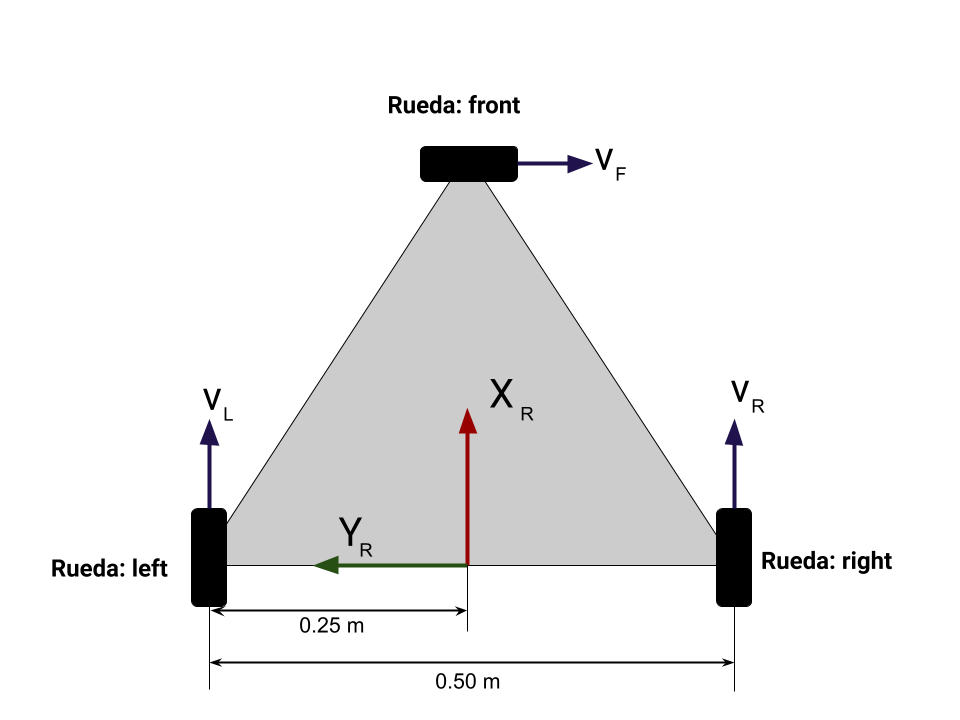

# Modelos de robots para prueba de pub/sub

En este paquete se encuentran los modelos de los robots para realizar los ejercicios de publicadores y subscriptores de ROS de la clase de RyCSV.

## Robot 1

El robot 1 tiene tres ruedas tipo suecas con los rodillos a 90 grados:

Las ruedas estan en las esquinas de un triangulo rectangulo de lado 

La configuración de las ruedas y del sistema de referencia del robot es como se muestra en la imagen inferior:

Con esta configuración se obtienen los siguientes parametros:

<table class="tg">
<thead>
  <tr>
    <th class="tg-0pky"></th>
    <th class="tg-0pky"></th>
    <th class="tg-0pky"></th>
    <th class="tg-0pky"></th>
    <th class="tg-0pky"></th>
  </tr>
</thead>
<tbody>
  <tr>
    <td class="tg-0pky"></td>
    <td class="tg-0pky"></td>
    <td class="tg-0pky"></td>
    <td class="tg-0pky"></td>
    <td class="tg-0pky"></td>
  </tr>
  <tr>
    <td class="tg-0pky"></td>
    <td class="tg-0pky"></td>
    <td class="tg-0pky"></td>
    <td class="tg-0pky"></td>
    <td class="tg-0pky"></td>
  </tr>
  <tr>
    <td class="tg-0pky"></td>
    <td class="tg-0pky"></td>
    <td class="tg-0pky"></td>
    <td class="tg-0pky"></td>
    <td class="tg-0pky"></td>
  </tr>
</tbody>
</table>

 

## Robot 2

El robot 2 tiene cuatro ruedas tipo suecas con los rodillos a 90 grados:

Las ruedas estan en las esquinas de un cuadrado de lado  el cual esta rotado 45 grados.

La configuración de las ruedas y del sistema de referencia del robot es como se muestra en la imagen inferior:

